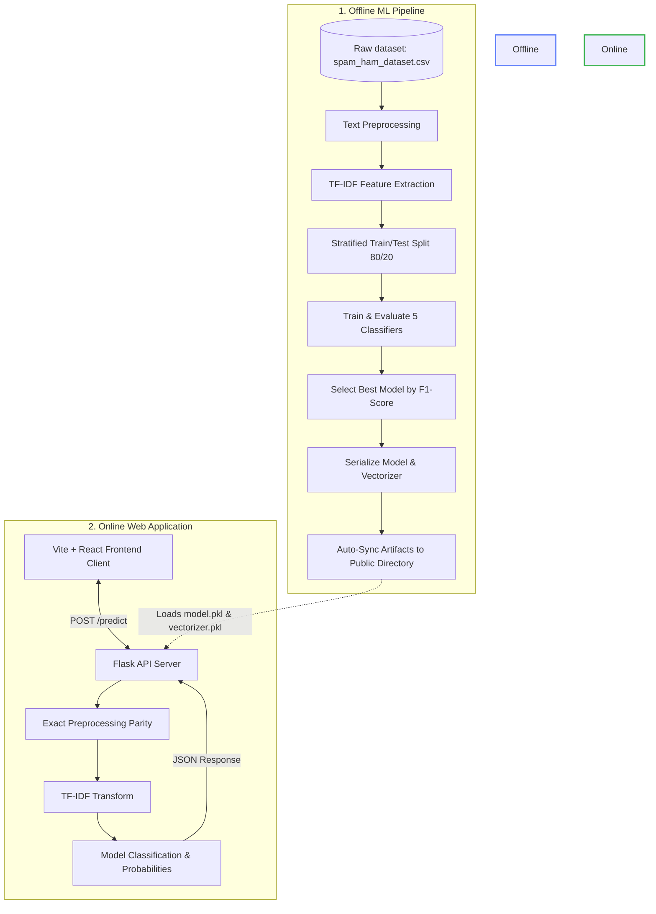

# 🛡️ SpamSpotter: End-to-End Email Spam Detection System

[](https://www.python.org/)
[](https://opensource.org/licenses/MIT)
[](https://vitejs.dev/)
[](https://react.dev/)
[](https://flask.palletsprojects.com/)
[](https://scikit-learn.org/)

An industry-grade, end-to-end Machine Learning system designed to analyze and classify email content into **Spam** or **Legitimate (Ham)** categories. The system consists of an offline model training/validation pipeline and an online web application featuring a high-performance Flask API backend and a responsive, modern Vite React frontend.

---

## 📐 System Architecture

The following diagram illustrates the lifecycle of the system, showing how the offline training pipeline feeds model artifacts to the online prediction backend.



---

## 🧠 Machine Learning & Model Performance

The training pipeline evaluates **five different classification algorithms** on a dataset of labeled email contents. All models use identical preprocessed texts vectorized via a Term Frequency-Inverse Document Frequency (TF-IDF) representation (including both unigram and bigram n-grams, restricted to the top 3,000 features).

### Preprocessing Parity (Pipeline & API)
To prevent inference-time accuracy degradation, text preprocessing is unified between the training script and the Flask API:
1. **Case Folding:** Converts all text to lowercase.
2. **Punctuation Clean:** Strips out non-alphabetic characters (preserving spaces).
3. **Regex Tokenization:** Extracts tokens conforming to `\b[a-z]+\b` boundaries.
4. **Negation-Preserving Stopwords:** Filters out standard English stopwords via NLTK, but explicitly retains negative qualifiers (`no` and `not`) which are strong semantic indicators.
5. **Lemmatization:** Reduces inflected words to their canonical base form using NLTK's `WordNetLemmatizer`.

### Model Evaluation Metrics
Following the stratified train-test split (80% training, 20% testing), the models achieved the following performance metrics on the test dataset:

| Rank | Model Name | Accuracy | Precision (Spam) | Recall (Spam) | F1-Score (Spam) | Training Time |
| :---: | :--- | :---: | :---: | :---: | :---: | :---: |
| 🥇 | **Logistic Regression** | **98.16%** | **96.37%** | **97.33%** | **96.85%** | **0.038s** |
| 🥈 | **Linear SVM** | 98.16% | 96.37% | 97.33% | 96.85% | 0.025s |
| 🥉 | **Random Forest** | 97.49% | 93.08% | 98.67% | 95.79% | 1.091s |
| 4 | **Gradient Boosting** | 96.52% | 91.51% | 97.00% | 94.17% | 15.610s |
| 5 | **Multinomial Naive Bayes** | 93.91% | 85.16% | 95.67% | 90.11% | 0.012s |

### Best Model Selection
Based on the metrics, **Logistic Regression** and **Linear SVM** achieved identical top F1-scores (~96.85%) and Accuracy (~98.16%). Logistic Regression was selected as the default production model due to its ability to compute well-calibrated class probability scores (`predict_proba`), which enables the user interface to display confidence scores for its classification decisions.

---

## 💻 Technical Stack

- **ML Pipeline (`/pipeline`)**: Python 3.11, Scikit-Learn, Pandas, NumPy, Matplotlib, Seaborn, NLTK, Joblib.
- **Web App Backend (`/engine/.../flask_api`)**: Python Flask, Flask-CORS, Gunicorn, NLTK, Scikit-Learn, NumPy.
- **Web App Frontend (`/engine/.../frontend`)**: Node.js, Vite, TypeScript, React 18, Tailwind CSS, Radix UI primitives, Lucide Icons, shadcn/ui.

---

## 📁 Repository Structure

```
Email spam detector/
├── .gitignore                # Root git exclusion configuration
├── README.md                 # System overview & installation guide
├── pipeline/                 # Model training pipeline
│   ├── spam.py               # Main pipeline script (Preprocess, Train, Evaluate, Sync)
│   ├── requirements.txt      # Pipeline Python packages
│   ├── archive.zip           # ZIP archive of training data
│   ├── archive/              # Dataset directory
│   │   └── spam_ham_dataset.csv # Raw labeled dataset (5,171 emails)
│   ├── eda_plots/            # Data visualization directories (generated)
│   │   ├── class_distribution.png
│   │   ├── text_length_by_label.png
│   │   └── word_count_by_label.png
│   ├── model.pkl             # Serialized production model (local)
│   ├── vectorizer.pkl        # Serialized TF-IDF vectorizer (local)
│   ├── model_metadata.json   # Best model metrics & training details
│   ├── model_performance.csv # Performance metrics table of trained classifiers
│   ├── train_data.csv        # Preprocessed training dataset
│   └── test_data.csv         # Preprocessed test dataset
└── engine/
    └── spam-spotter-engine/
        ├── flask_api/        # Production Flask backend
        │   ├── app.py        # Flask server routes & unpickling
        │   ├── requirements.txt # Backend Python requirements
        │   └── venv/         # Python virtual environment (ignored)
        └── frontend/         # React/Vite Frontend client
            ├── package.json  # NPM scripts & workspace dependencies
            ├── tailwind.config.ts # Tailwind styling system configuration
            ├── src/
            │   ├── components/ # Core React components (SpamDetector.tsx)
            │   ├── pages/      # Router pages (Index.tsx, NotFound.tsx)
            │   └── lib/        # Front-end helper libraries and static types
            └── public/
                └── models/   # Production model artifacts directory (Auto-synced)
                    ├── model.pkl
                    ├── vectorizer.pkl
                    └── model_metadata.json
```

---

## 🚀 Setup & Execution Guide

Follow these steps to configure your environment and run the pipeline and application.

### 1. Training and Syncing the ML Model

The pipeline trains models and automatically copies model artifacts to the web server's static directory.

```bash
# Navigate to the pipeline directory
cd pipeline

# Install dependencies
pip install -r requirements.txt

# Run the training pipeline
python spam.py
```
*Note: To skip the time-consuming text preprocessing stage, use `python spam.py --phase select` if `train_data.csv` and `test_data.csv` are already generated.*

### 2. Launching the Web Application

The system is configured to launch the backend and frontend simultaneously.

#### Step 1: Install Frontend Packages
```bash
cd engine/spam-spotter-engine/frontend
npm install
```

#### Step 2: Set Up Backend Virtual Environment
It is highly recommended to run the Flask backend in a virtual environment to isolate the specific versions of Numpy/Scikit-Learn:
```bash
cd ../flask_api
python -m venv venv

# Activate venv & install dependencies
# On Windows:
.\venv\Scripts\pip install -r requirements.txt
# On Linux/macOS:
source venv/bin/activate && pip install -r requirements.txt
```

#### Step 3: Run the Concurrent Dev Servers
From the `frontend` directory, start both systems concurrently:
```bash
cd ../frontend
npm run dev
```
- **Vite Frontend Dev Client:** `http://localhost:8080`
- **Flask REST API:** `http://localhost:5000`

---

## 🔌 API Documentation

The Flask API exposes the following endpoints:

### `GET /health`
Verifies server health and checks the currently loaded model characteristics.
- **Response Structure (200 OK):**
  ```json
  {
    "status": "healthy",
    "model": "Logistic Regression",
    "featureCount": 3000,
    "version": "1.0"
  }
  ```

### `GET /model-info`
Exposes the metrics and metadata computed during the training run.
- **Response Structure (200 OK):**
  ```json
  {
    "model_name": "Logistic Regression",
    "f1_score": 0.9684908789386402,
    "accuracy": 0.9816425120772947,
    "precision": 0.9636963696369637,
    "recall": 0.9733333333333334,
    "training_timestamp": "2026-07-07T01:54:26",
    "feature_count": 3000
  }
  ```

### `POST /predict`
Performs classification on a raw email string.
- **Request Body:**
  ```json
  {
    "text": "Dear Friend, CONGRATULATIONS! You have been selected as our lottery winner! Click here to transfer your funds: http://bit.ly/prize"
  }
  ```
- **Response Structure (200 OK):**
  ```json
  {
    "isSpam": true,
    "confidence": 0.8020656457306077,
    "spamProbability": 0.8020656457306077,
    "prediction": "spam"
  }
  ```
